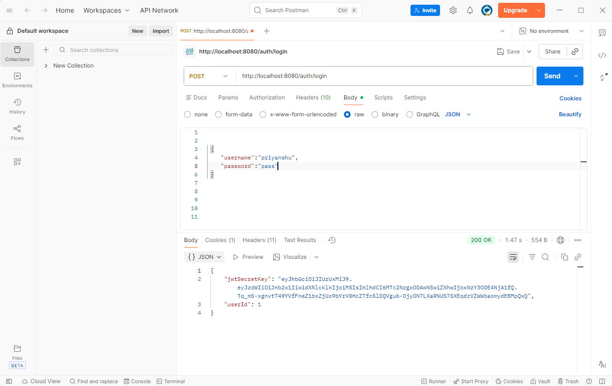
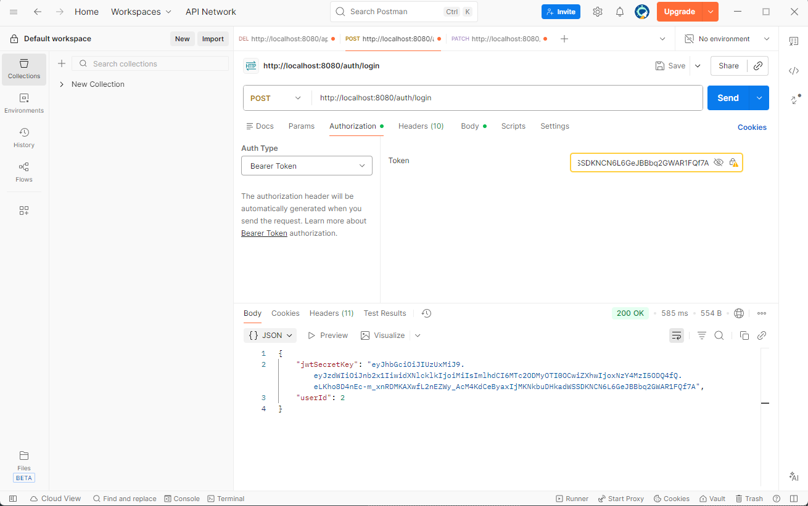

# Hospital Management System 

## Description
### Hospital management system using persistence layer to save data in database with relationship between entities and implemented security layer with JWT authentication and Role based authorization.

## Features
- Secure login using JWT authentication to generate a token for authorization.
- Admin can access all features like deleting or updating patients and doctors.
- Patient can only create and update their own data after successful authorization.
- Doctor can manage and view their own appointments and departments after successful authorization.
- Appointments can be fully created, read, updated, and deleted by Admin after authorization.
- Insurance details are accessible by Admin and Doctors only; not mandatory for all patients.
- Entity relationships (`@OneToOne`, `@OneToMany`, `@ManyToOne`) create foreign key mappings.
- JWT Authentication confirms user identity and saves `userId` in Patient and Doctor entities using `@MapsId`.
- Role and permission-based authorization (`@PreAuthorize`) ensures users can only access allowed features.


## Project Structure
- **Patient** – Stores patient details and linked with a user via `@OneToOne`.
- **Insurance** – Optional for patients; not mandatory for all.
- **Appointment** – Stores patient appointments and linked with a doctor.
- **Doctor** – Stores doctor details and linked with a department.
- **Department** – Stores department details linked to doctors.


## Dependencies / Tech Stack
- **Java 21**
- **Spring Boot**
- **Spring Data JPA**
- **PostgresSQL Driver**
- **Maven**
- **JUnit 5** (for testing)
- **Lombok**
- **Spring Boot DevTools**
- **Validation API**
- **Spring Web**
- **Spring Security**
- **jjwt-api**
- **jjwt-impl**
- **jjwt-jackson**

## API Endpoints
- `/auth/**` – Public endpoints for login and registration (no token required)
- `/admin/**` – Admin-only endpoints, e.g., assign roles, delete users
- `/api/**` – Role-based endpoints:
    - `PATIENT` can create/update own data
    - `DOCTOR` can manage own appointments and departments
    - `ADMIN` can manage everything

### Root Files:

```plaintext

+---src
|   +---main
|   |   +---java
|   |   |   \---com
|   |   |       \---example
|   |   |           \---Hoshpital
|   |   |               \---Management
|   |   |                   \---System
|   |   |                       |   HoshpitalManagementSystemApplication.java
|   |   |                       |
|   |   |                       +---config
|   |   |                       |       AppConfig.java
|   |   |                       |
|   |   |                       +---controller
|   |   |                       |       AdminController.java
|   |   |                       |       AppointmentController.java
|   |   |                       |       AuthController.java
|   |   |                       |       DepartmentController.java
|   |   |                       |       DoctorController.java
|   |   |                       |       InsuranceController.java
|   |   |                       |       PatientController.java
|   |   |                       |
|   |   |                       +---entity
|   |   |                       |   |   Appointment.java
|   |   |                       |   |   Department.java
|   |   |                       |   |   Doctor.java
|   |   |                       |   |   Insurance.java
|   |   |                       |   |   Patient.java
|   |   |                       |   |   User.java
|   |   |                       |   |
|   |   |                       |   \---type
|   |   |                       |           BloodGroupType.java
|   |   |                       |           RolePermissionType.java
|   |   |                       |           RoleType.java
|   |   |                       |
|   |   |                       +---modal
|   |   |                       |       AppointmentDto.java
|   |   |                       |       DepartmentDto.java
|   |   |                       |       DoctorDto.java
|   |   |                       |       InsuranceDto.java
|   |   |                       |       LoginUserDto.java
|   |   |                       |       PatientDto.java
|   |   |                       |       SignupUserDto.java
|   |   |                       |       TokenResponseDto.java
|   |   |                       |
|   |   |                       +---repository
|   |   |                       |       AppointmentRepository.java
|   |   |                       |       AuthRepository.java
|   |   |                       |       DepartmentRepository.java
|   |   |                       |       DoctorRepository.java
|   |   |                       |       InsuranceRepository.java
|   |   |                       |       PatientRepository.java
|   |   |                       |
|   |   |                       +---security
|   |   |                       |       AuthService.java
|   |   |                       |       CustomUserDetailsService.java
|   |   |                       |       JwtAuthFilter.java
|   |   |                       |       JwtUtil.java
|   |   |                       |       RolePermissionMapping.java
|   |   |                       |       WebSecurityConfig.java
|   |   |                       |
|   |   |                       \---service
|   |   |                           |   AdminService.java
|   |   |                           |   AppointmentService.java
|   |   |                           |   DepartmentService.java
|   |   |                           |   DoctorService.java
|   |   |                           |   InsuranceService.java
|   |   |                           |   PatientService.java
|   |   |                           |
|   |   |                           \---Impl
|   |   |                                   AdminServiceImpl.java
|   |   |                                   AppointmentServiceImpl.java
|   |   |                                   DepartmentServiceImpl.java
|   |   |                                   DoctorServiceImpl.java
|   |   |                                   InsuranceServiceImpl.java
|   |   |                                   PatientServiceImpl.java
|   |   |
|   |   \---resources
|   |       |   application.properties
|   |       |
|   |       +---static
|   |       \---templates
```


## API Demo

**JWT Authentication**  


**Role And Permission Based Authorization**



## How To Run Application
1. Clone the repository and open in your IDE.
2. Run the main Spring Boot application.
3. Use Postman (or any API client) to interact with the API endpoints.


